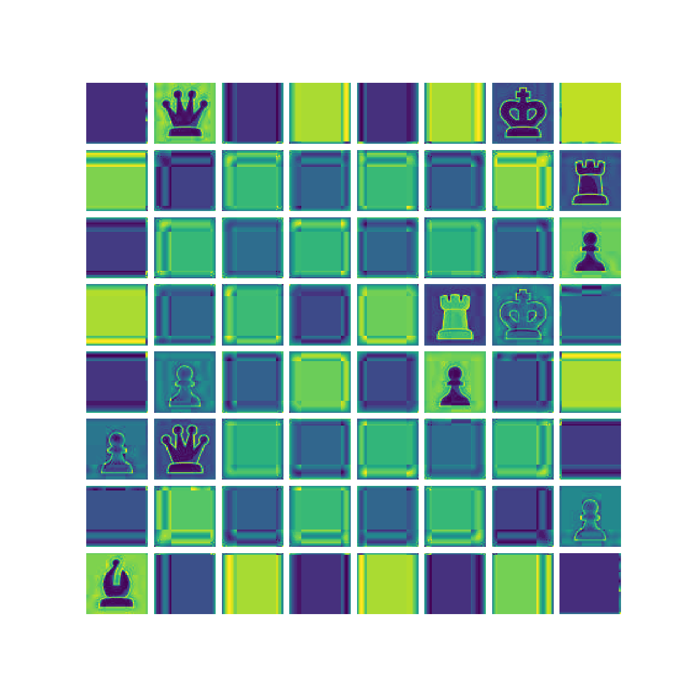
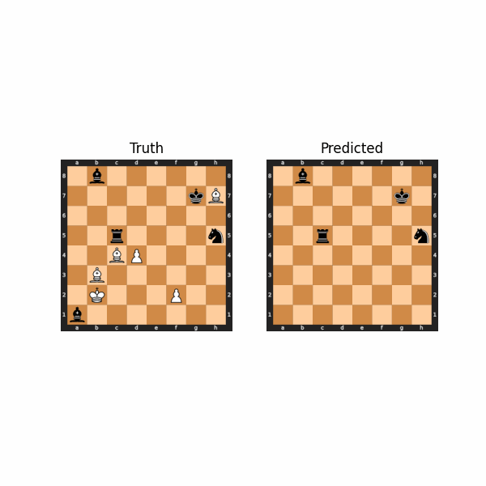

<h1 align="center"> Chess-Vision (Image to FEN)</h1>
</br>
<p align="center">
A deep computer vision model to take images of digital chess boards and return their FEN representation.
</p>

<h2 align="center"> Overview </h2>

<h4> Initial image </h4>


<h4> Strip colors and split into squares </h4>



<h4> Classify each square to produce a prediction </h4>



<h2> Data </h2>

- Source: <a href=https://www.kaggle.com/datasets/koryakinp/chess-positions>Kaggle Chess Positions - koryakinp</a>
- Dimensions: 400x400x3
- Variations: 28 board styles and 32 piece styles
- Complexity: 5-15 pieces per board
- Train/Test: 80000/200000

<h2> CNN Model </h2>

Training
```shell
python train.py --config configs/config_CNN.yaml
```
Inference (in progress)
```shell
python inference.py --sample path/to/sample.jpeg
```
Visualizations (in progress)
```shell
python visualize_training.py
```
<h4> Model Details </h4>
Params: found in configs/config_CNN.yaml

Process:
  1) Size 1, stride 1 CNN to convert from 3 color channels to 1
  2) Split image into 64 squares for each square on a chess board
  3) Pass each square through learned linear classifier to get piece
  4) Calculate loss per square
  5) Since the output of the model is different from actual FEN notation, to see final notation just process the sequence of class scores to create FEN
     - Example: 00102007 -> 2p1P2r

<h2> (In Progress) Transformer Model </h2>

- This will split board squares into tokens
- Then embed tokens into d_model space and positionally encode
- Pass through transformer encoder layers
- Extract vocab scores for every output token
- Use cross-entropy loss to classify sequence

<h4> Issues </h4>

- Cross-entropy loss for the whole sequence seems too hard to learn
  - could make a loss
  - or rephrase problem at the end
 

<h2> TODO </h2>
- explore transformer model